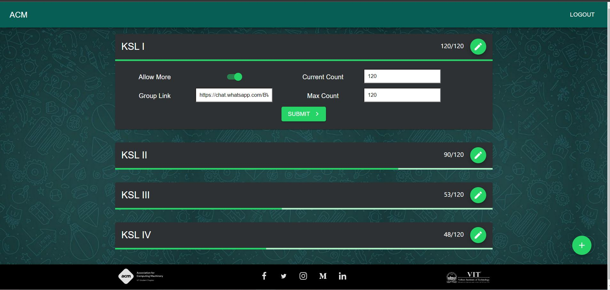

<h1 align="center"> ACM CONNECT FRONTEND </h1>

<p align="center"> 
Frontend web app for the admins to perform CRUD operations on the ACM Connect database.
</p>

<p>
  <a href="https://acmvit.in/" target="_blank">
    
  </a>
</p>

---
Uses axios for fetching and sending data to the server
- Fetches data every time a new user clicks the link 
- An option to manually set the next upper limit
- Admins can update/change the invite links
- Admins can manually close the group to prevent new entries
- Updates the current count of members present in the group
- A feature to add new groups

---

## Screenshots

 


---

## Usage

To setup project locally, fork the repository.

```console
# Install Packages
npm i

# Build Script
npm run build

# Run the server
npm start
```

---

## Authors

**Contributors:** 
[Ananya Grover](https://github.com/ananyagrover14), [Likhit Ajeesh](https://github.com/Likkiii), [Pranav Desai](https://github.com/pranavvdesai), [Shreyas k](https://github.com/HelixW), [Yash Kumar Verma](https://github.com/YashKumarVerma)  

